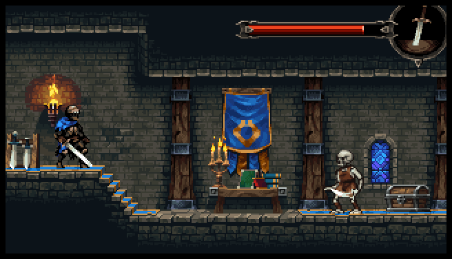
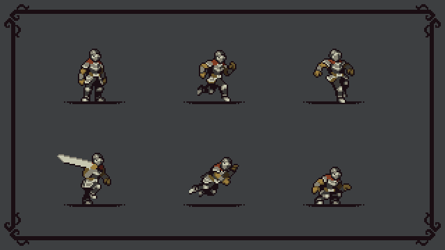

# lysenko_iryna-tp2-582_301
Projet TP2 en interactivité ludique

## Intention

Le jeu est un petit platformer dans un château médiéval. Le joueur contrôle un chevalier qui doit monter sur le toit, trouver une clé et ouvrir les portes du château. Sur son chemin, il rencontre des pièges comme des piques et des plateformes. L’atmosphère est sombre, retro, renforcée par des éléments décoratifs tels que des torches, des chaînes, des drapeaux et des débris. Derrière les portes, le joueur rencontre un autre chevalier qui prononce une réplique finale et le niveau se termine. Pour les médias visuels, j’ai choisi un pack d’assets en pixel art médiéval pour le décor du château et un personnage de chevalier animé, ce qui permet de garder une cohérence graphique. Pour le son, j’ai opté pour des effets simples (pas, armes, coffres) et une musique rétro avec une ambiance mystique et médiévale afin de renforcer l’immersion.

L’objectif du projet est de démontrer une structure de scène claire, une gestion fluide des animations et une bonne organisation du code.

https://brullov.itch.io/2d-platformer-asset-pack-castle-of-despair
https://aamatniekss.itch.io/fantasy-knight-free-pixelart-animated-character

## Arborescence de la scène principale

## Instructions d’opération

Déplacement : flèches gauche/droite ou touches A / D

Saut : touche Espace ou W

Objectif : éviter les piques et atteindre la fin du niveau

Sons : les pas se déclenchent automatiquement quand le joueur marche

## Notes techniques

Le son des pas est en boucle (loop = true) et ne joue que lorsque le joueur est sur le sol.

Les animations sont gérées via AnimatedSprite2D dans le script player.gd.

Le système de gravité et de saut utilise les méthodes is_on_floor() et velocity.y.
